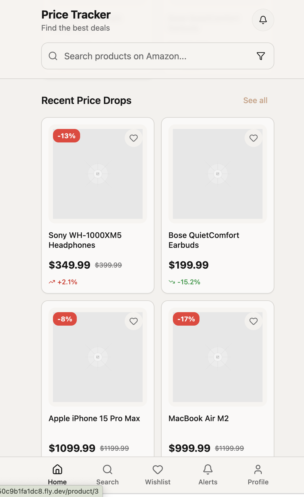
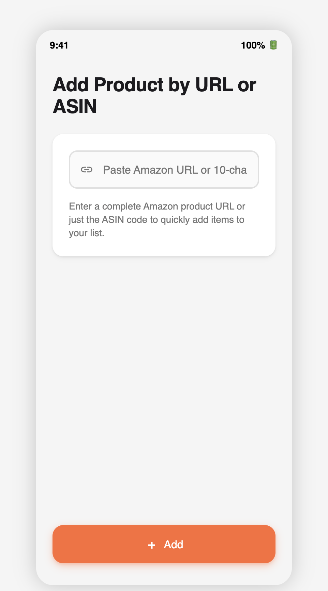

# Amazon Price Tracker (Android)

An Android application that allows users to track the price history and current price of Amazon products.  
Users can add items to their wishlist and receive notifications when prices drop.  

## 📱 Features
- Add products to a wishlist by entering Amazon product details
- Track current product price using Amazon’s API
- Display simple UI to manage wishlisted items

## 📌 Future Implementation (To-Do)
- Receive price-drop notifications
- Data persistence with local storage (Room Database)
- Dark mode support

## 🛠️ Tech Stack
- **Language:** Java
- **Framework:** Android SDK (Android Studio)
- **Networking:** Retrofit (with **CanopyAPI** integration)
- **Architecture:** 
- **Database:** 
- **UI:** Material Design Components
  
## 🌐 API Integration
This app uses **[CanopyAPI](https://canopyapi.co/)** to fetch product data from Amazon:  
- Retrieves product details by ASIN or URL
- Provides pricing, images, and metadata  
- Integrated via Retrofit with custom headers and authentication
  
## 📋 Project Management & Tools
- **Confluence** for writing the design document and project documentation  
- **Jira** for tracking tasks, features, and progress
- **AI-assisted tools** (ChatGPT, Gemini in Android Studio) for debugging, standard setup code, and learning support

## 🎨 UI/UX Design Drafts

  
  

## 🚀 Getting Started

### Prerequisites
- [Android Studio](https://developer.android.com/studio)
- Android SDK 21 (Lollipop) or higher
- A physical or virtual Android device to run the app
- A **CanopyAPI key** (sign up at [CanopyAPI](https://canopyapi.co/))

### Installation
